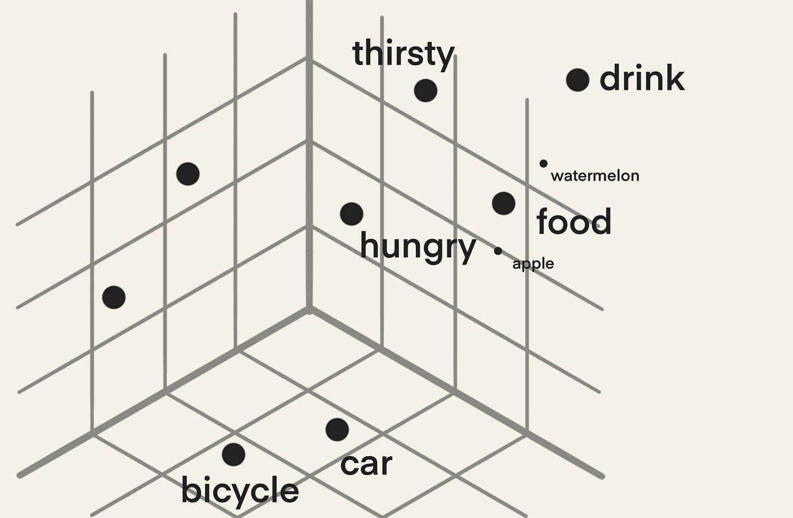

")

Vector databases have been getting a lot of attention recently, with many vector database startups raising millions in funding.

Chances are you have probably already heard of them but didn't really care about them until now - at least, that's what I guess why you are here now…

If you are here just for the short answer, let's jump right in:

## Definition: What is a Vector Database?
A vector database is a type of database that stores and manages unstructured data, such as text, images, or audio, in vector embeddings (high-dimensional vectors) to make it easy to find and retrieve similar objects quickly.

---

If that definition only caused more confusion, then let's go step by step. This article is inspired by [WIRED's "5 Levels" Video Series](https://www.wired.com/video/series/5-levels) and unpacks what vector databases are in the following three levels of difficulty:

- Explain It Like I'm 5
- Explaining Vector Databases to Digital Natives and Tech Enthusiasts
- Explaining Vector Databases to Engineers and Data Professionals

## Vector Databases: Explain It Like I'm 5 (ELI5)

This is slightly off-topic, but do you know what I don't understand?

When people arrange their bookshelves by color. - Yikes!

How do they find a book when they don't know what color the book cover is?

 on Unsplash](images/books.jpg )

### The intuition behind vector databases

If you want to find a specific book quickly, arranging your bookshelf by genre and then by the author makes much more sense than by color. That's why most libraries are organized in this way to help you find what you're looking for quickly.

But how do you find something to read based on a query instead of a genre or an author? What if you want to read a book that is, for example:

- similar to "The Very Hungry Caterpillar" or
- about a main character that likes eating as much as you do?

If you don't have the time to browse the bookshelves, the fastest way to go about this would be to ask the librarian for their recommendation because they have read a lot of the books and will know exactly which one fits your query best.

---

In the example of organizing books, you can think of the librarian as a vector database because vector databases are designed to store complex information (e.g., the plot of a book) about an object (e.g., a book). Thus, vector databases can help you find objects based on a specific query (e.g., a book that is about…) rather than a few pre-defined attributes (e.g., author) - just like a librarian.

## Explaining Vector Databases to Digital Natives and Tech Enthusiasts
Now, let's stick to the library example and get a little bit more technical: Of course, these days, there are more advanced techniques to search for a book in a library than only by genre or author.

If you visit a library, there's usually a computer in the corner that helps you find a book with some more specific attributes, like title, ISBN, year of publication, or some keywords. Based on the values you enter, a database of the available books is then queried. This database is usually a traditional relational database.


### What is the difference between a relational database and a vector database?
The main difference between relational databases and vector databases lies in the **type of data** they store. 
While relational databases are designed for **structured data** that fits into tables, vector databases are intended for **unstructured data**, such as text or images.

The type of data that is stored also influences **how the data is retrieved**: In relational databases, query results are based on **matches** for specific keywords. In vector databases, query results are based on **similarity**.

---

You can think of traditional relational databases like spreadsheets. They are great for storing structural data, such as base information about a book (e.g., title, author, ISBN, etc.), because this type of information can be stored in columns, which are great for filtering and sorting.

With relational databases, you can quickly get all the books that are, e.g., children's books, and have "caterpillar" in the title.

But what if you liked that "The Very Hungry Caterpillar" was about food? You could try to search for the keyword "food", but unless the keyword "food" is mentioned in the book's summary, you aren't even going to find "The Very Hungry Caterpillar". Instead, you will probably end up with a bunch of cookbooks and disappointment.

And this is one limitation of relational databases: You must add all the information you think someone might need to find that specific item. But how do you know which information and how much of it to add? Adding all this information is **time-consuming** and does not guarantee completeness.

Now this is where vector databases come into play!

---

But first, a little detour on a concept called **vector embeddings**
.
Today's Machine Learning (ML) algorithms can convert a given object (e.g., word or text) into a numerical representation that preserves the information of that object. Imagine you give an ML model a word (e.g., "food"), then that ML model does its magic and returns you a long list of numbers. This long list of numbers is the numerical representation of your word and is called vector embedding.

Because these embeddings are a long list of numbers, we call them high-dimensional. Let's pretend for a second that these embeddings are only three-dimensional to visualize them as shown below.



You can see that similar words like "hungry", "thirsty", "food", and "drink" are all grouped in a similar corner, while other words like "bicycle" and "car" are close together but in a different corner in this vector space.

The numerical representations enable us to apply mathematical calculations to objects, such as words, which are usually not suited for calculations. For example, the following calculation will not work unless you replace the words with their embeddings:

```
drink - food + hungry = thirsty
```

And because we are able to use the embeddings for calculations, we can also calculate the distances between a pair of embedded objects. The closer two embedded objects are to one another, the more similar they are.

---

As you can see, vector embeddings are pretty cool.

Let's go back to our example and say we embed the content of every book in the library and store these embeddings in a vector database. Now, when you want to find a "children's book with a main character that likes food", your query is also embedded, and the books that are most similar to your query are returned, such as "The Very Hungry Caterpillar" or maybe "Goldilocks and the Three Bears".

### What are the use cases of vector databases?

Vector databases have been around before the hype around Large Language Models (LLMs) started. Originally, they were used in recommendation systems because they can quickly find similar objects for a given query. But because they can provide long-term memory to LLMs, they have also been used in question-answering applications recently.

## Explaining Vector Databases to Engineers and Data Professionals

If you could already guess that vector databases are probably a way to store vector embeddings before opening this article and just want to know what vector embeddings are under the hood, then let's get into the nitty-gritty and talk about algorithms.

### How do vector databases work?
Vector databases are able to retrieve similar objects of a query quickly because they have already pre-calculated them. The underlying concept is called Approximate Nearest Neighbor (ANN) search, which uses different algorithms for indexing and calculating similarities.

As you can imagine, calculating the similarities between a query and every embedded object you have with a simple k-nearest neighbors (kNN) algorithm can become time-consuming when you have millions of embeddings. With ANN, you can trade in some accuracy in exchange for speed and retrieve the approximately most similar objects to a query.

**Indexing** - For this, a vector database **indexes** the vector embeddings. This step maps the vectors to a data structure that will enable faster searching.

You can think of indexing as grouping the books in a library into different categories, such as author or genre. But because embeddings can hold more complex information, further categories could be "gender of the main character" or "main location of plot". Indexing can thus help you retrieve a smaller portion of all the available vectors and thus speeds up retrieval.

We will not go into the technical details of indexing algorithms, but if you are interested in further reading, you might want to start by looking up Hierarchical Navigable Small World (HNSW).

**Similarity Measures** - To find the nearest neighbors to the query from the indexed vectors, a vector database applies a similarity measure. Common similarity measures include cosine similarity, dot product, Euclidean distance, Manhattan distance, and Hamming distance.

### What is the advantage of vector databases over storing the vector embeddings in a NumPy array?
A question I have come across often (already) is: **Can't we just use NumPy arrays to store the embeddings?** - Of course, you can if you don't have many embeddings or if you are just working on a fun hobby project. But as you can already guess, vector databases are noticeably faster when you have a lot of embeddings, and you don't have to hold everything in memory.

*I'll keep this short because [Ethan Rosenthal has done a much better job explaining the difference between using a vector database vs. using a NumPy array](https://www.ethanrosenthal.com/2023/04/10/nn-vs-ann/) than I could ever write.*

---

*This blog was originally published on Towards Data Science on Jul 4, 2023 and moved to this site on Jul 30, 2025.*