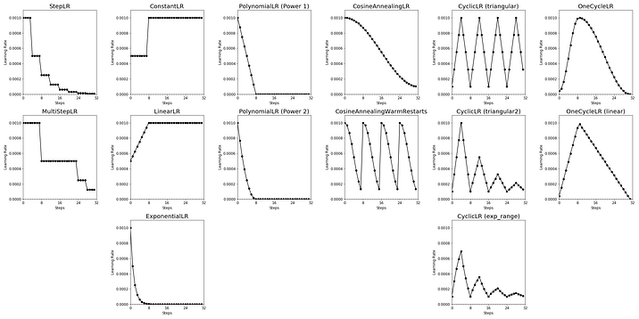
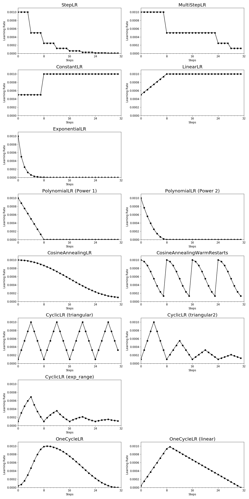

## What is the Learning Rate in Deep Learning?

Neural networks have many hyperparameters that affect the model’s performance. One of the **essential hyperparameters** is the learning rate (LR), which determines how much the model weights change between training steps. In the simplest case, the LR value is a fixed value between 0 and 1.

However, choosing the correct LR value can be challenging. On the one hand, a **large learning rate** can help the algorithm to converge quickly. But it can also cause the algorithm to bounce around the minimum without reaching it or even jumping over it if it is too large. On the other hand, a **small learning rate** can converge better to the minimum. 
However, the optimizer may take too long to converge or get stuck in a plateau if it is too small.

## What is a Learning Rate Scheduler?

One solution to help the algorithm **converge quickly** to an optimum is to use a learning rate scheduler. A learning rate scheduler adjusts the learning rate according to a pre-defined schedule during the training process.

> One solution to help the algorithm converge quickly to an optimum is to use a learning rate scheduler.

Usually, the learning rate is set to a higher value at the beginning of the training to allow faster convergence. As the training progresses, the learning rate is reduced to enable convergence to the optimum and thus leading to better performance. Reducing the learning rate over the training process is also known as **annealing or decay**.

---

The amount of different learning rate schedulers can be overwhelming. Thus, this article aims to give you an overview of how different pre-defined learning rate schedulers in PyTorch adjust the learning rate during training.

## Learning Rate Schedulers

For this article, we use the PyTorch version 1.13.0. You can read more in the [PyTorch documentation](https://pytorch.org/docs/stable/optim.html) for more details on the learning rate schedulers.

```python
import torch
```

You can find the Python code used to visualize the PyTorch learning rate schedulers in the appendix at the end of this article.

### StepLR

The [`StepLR`](https://pytorch.org/docs/stable/generated/torch.optim.lr_scheduler.StepLR.html#torch.optim.lr_scheduler.StepLR) reduces the learning rate by a multiplicative factor after every predefined number of training steps.

```python
from torch.optim.lr_scheduler import StepLR

scheduler = StepLR(optimizer, 
                   step_size = 4, # Period of learning rate decay
                   gamma = 0.5) # Multiplicative factor of learning rate decay
```


### MultiStepLR

The [`MultiStepLR`](https://pytorch.org/docs/stable/generated/torch.optim.lr_scheduler.MultiStepLR.html#torch.optim.lr_scheduler.MultiStepLR) — similarly to the `StepLR` — also reduces the learning rate by a multiplicative factor but after each pre-defined milestone.

```python
from torch.optim.lr_scheduler import MultiStepLR

scheduler = MultiStepLR(optimizer, 
                        milestones=[8, 24, 28], # List of epoch indices
                        gamma =0.5) # Multiplicative factor of learning rate decay
```


### ConstantLR

The [`ConstantLR`](https://pytorch.org/docs/stable/generated/torch.optim.lr_scheduler.ConstantLR.html#torch.optim.lr_scheduler.ConstantLR) reduces learning rate by a multiplicative factor until the number of training steps reaches a pre-defined milestone.

```python
from torch.optim.lr_scheduler import ConstantLR

scheduler = ConstantLR(optimizer, 
                       factor = 0.5, # The number we multiply learning rate until the milestone.
                       total_iters = 8) # The number of steps that the scheduler decays the learning rate
```


As you might have already noticed, if your starting factor is smaller than 1, this learning rate scheduler increases the learning rate over the course of the training process instead of decreasing it.

### LinearLR

The [`LinearLR`](https://pytorch.org/docs/stable/generated/torch.optim.lr_scheduler.LinearLR.html#torch.optim.lr_scheduler.LinearLR) — similarly to the `ConstantLR` — also reduces the learning rate by a multiplicative factor at the beginning of the training. But it linearly increases the learning rate over a defined number of training steps until it reaches its originally set learning rate.

```python
from torch.optim.lr_scheduler import LinearLR

scheduler = LinearLR(optimizer, 
                     start_factor = 0.5, # The number we multiply learning rate in the first epoch
                     total_iters = 8) # The number of iterations that multiplicative factor reaches to 1
```


If your starting factor is smaller than 1, this learning rate scheduler also increases the learning rate over the course of the training process instead of decreasing it.

### ExponentialLR

The [`ExponentialLR`](https://pytorch.org/docs/stable/generated/torch.optim.lr_scheduler.ExponentialLR.html#torch.optim.lr_scheduler.ExponentialLR) reduces learning rate by a multiplicative factor at every training step.

```python
from torch.optim.lr_scheduler import ExponentialLR

scheduler = ExponentialLR(optimizer, 
                          gamma = 0.5) # Multiplicative factor of learning rate decay.
```


### PolynomialLR

The [`PolynomialLR`](https://pytorch.org/docs/stable/generated/torch.optim.lr_scheduler.PolynomialLR.html#torch.optim.lr_scheduler.PolynomialLR) reduces learning rate by using a polynomial function for a defined number of steps.

```python
from torch.optim.lr_scheduler import PolynomialLR

scheduler = PolynomialLR(optimizer, 
                         total_iters = 8, # The number of steps that the scheduler decays the learning rate.
                         power = 1) # The power of the polynomial.
```

Below you can see the resulting learning rate decay for `power = 1`.


With `power = 2` the resulting learning rate decay will look like this.


### CosineAnnealingLR

The [`CosineAnnealingLR`](https://pytorch.org/docs/stable/generated/torch.optim.lr_scheduler.CosineAnnealingLR.html#torch.optim.lr_scheduler.CosineAnnealingLR) reduces learning rate by a cosine function.

While you could technically schedule the learning rate adjustments to follow multiple periods, the idea is to decay the learning rate over half a period for the maximum number of iterations.

```python
from torch.optim.lr_scheduler import CosineAnnealingLR

scheduler = CosineAnnealingLR(optimizer,
                              T_max = 32, # Maximum number of iterations.
                             eta_min = 1e-4) # Minimum learning rate.
```


Philipp Singer and Yauhen Babakhin, two Kaggle Competition Grandmasters, recommend using cosine decay as a learning rate scheduler for deep transfer learning [2].

### CosineAnnealingWarmRestartsLR

The [`CosineAnnealingWarmRestarts`](https://pytorch.org/docs/stable/generated/torch.optim.lr_scheduler.CosineAnnealingWarmRestarts.html#torch.optim.lr_scheduler.CosineAnnealingWarmRestarts) is similar to the cosine annealing schedule. However, it allows you to restart the LR schedule with the initial LR at, e.g., each epoch.

```python
from torch.optim.lr_scheduler import CosineAnnealingWarmRestarts

scheduler = CosineAnnealingWarmRestarts(optimizer, 
                                        T_0 = 8,# Number of iterations for the first restart
                                        T_mult = 1, # A factor increases TiTi​ after a restart
                                        eta_min = 1e-4) # Minimum learning rate
```


This is called a warm restart and was introduced in 2017 [1]. Increasing the LR causes the model to diverge. However, this intentional divergence enables the model to escape local minima and find an even better global minimum.

### CyclicLR

The [`CyclicLR`](https://pytorch.org/docs/stable/generated/torch.optim.lr_scheduler.CyclicLR.html#torch.optim.lr_scheduler.CyclicLR) adjusted the learning rate according to a cyclical learning rate policy, which is based on the concept of warm restarts which we just discussed in the previous section. In PyTorch there are three built-in policies.

```python
from torch.optim.lr_scheduler import CyclicLR

scheduler = CyclicLR(optimizer, 
                     base_lr = 0.0001, # Initial learning rate which is the lower boundary in the cycle for each parameter group
                     max_lr = 1e-3, # Upper learning rate boundaries in the cycle for each parameter group
                     step_size_up = 4, # Number of training iterations in the increasing half of a cycle
                     mode = "triangular")
```

With `mode = "triangular"` the resulting learning rate decay will follow a basic triangular cycle without amplitude scaling, which will look like this.


With `mode = "triangular2"` the resulting learning rate decay will follow a basic triangular cycle that scales the initial amplitude by half at each cycle, which will look like this.


With `mode = "exp_range"` the resulting learning rate decay will look like this.


### OneCycleLR

The [`OneCycleLR`](https://pytorch.org/docs/stable/generated/torch.optim.lr_scheduler.OneCycleLR.html#torch.optim.lr_scheduler.OneCycleLR) reduces learning rate according to the 1cycle learning rate policy, which was introduced in a paper in 2017 [3].

In contrast to many other learning rate schedulers, the learning rate is not only decreased over the training process. Instead, the learning rate increases from an initial learning rate to some maximum learning rate and then decreases again.

```python
from torch.optim.lr_scheduler import OneCycleLR

scheduler = OneCycleLR(optimizer, 
                       max_lr = 1e-3, # Upper learning rate boundaries in the cycle for each parameter group
                       steps_per_epoch = 8, # The number of steps per epoch to train for.
                       epochs = 4, # The number of epochs to train for.
                       anneal_strategy = 'cos') # Specifies the annealing strategy
```

With `anneal_strategy = "cos"` the resulting learning rate decay will look like this.


With `anneal_strategy = "linear"` the resulting learning rate decay will look like this.


### ReduceLROnPlateauLR

The [`ReduceLROnPlateau`](https://pytorch.org/docs/stable/generated/torch.optim.lr_scheduler.ReduceLROnPlateau.html#torch.optim.lr_scheduler.ReduceLROnPlateau) reduces the learning rate by when the metric has stopped improving. As you can guess, this is difficult to visualize because the learning rate reduction timing depends on your model, data, and hyperparameters.

### Custom Learning Rate Schedulers with Lambda Functions

If the built-in learning rate schedulers don’t fit your needs, you have the possibility to define a scheduler with lambda functions. The lambda function is a function that returns a multiplicative factor based on the epoch value.

The [`LambdaLR`](https://pytorch.org/docs/stable/generated/torch.optim.lr_scheduler.LambdaLR.html#torch.optim.lr_scheduler.LambdaLR) adjusts the learning rate by applying the multiplicative factor from the lambda function to the initial LR.

```python
lr_epoch[t] = lr_initial * lambda(epoch)
```

On the other hand, the [`MultiplicativeLR`](https://pytorch.org/docs/stable/generated/torch.optim.lr_scheduler.MultiplicativeLR.html#torch.optim.lr_scheduler.MultiplicativeLR) adjusts the learning rate by applying the multiplicative factor from the lambda function to the LR from the previous epoch.

```python
lr_epoch[t] = lr_epoch[t-1] * lambda(epoch)
```

These learning rate schedulers are also a little bit difficult to visualize because they highly depend on the defined lambda function.

## Conclusion and Visual Cheat Sheet

Now that you have seen a variety of different built-in PyTorch learning rate schedulers, you are probably curious about which learning rate scheduler you should choose for your Deep Learning project.

Unfortunately, the answer is not that easy — as often in life. For a while, `ReduceLROnPlateau` was a popular learning rate scheduler. Today, other approaches like CosineAnnealingLR and OneCycleLR or approaches with warm restarts like `CosineAnnealingWarmRestarts` and `CyclicLR` have been increasing in popularity.

Nonetheless, you might need to run a few experiments to determine which learning rate scheduler best suits your problem. But, what we can say is that using any learning scheduler will most likely lead to better model performance.

Below is a visual summary of the discussed learning rate schedulers in PyTorch.



## References

[1] Loshchilov, I., & Hutter, F. (2016). Sgdr: Stochastic gradient descent with warm restarts. arXiv preprint arXiv:1608.03983.

[2] Singer, P. & Babakhin, Y. (2022) Practical Tips for Deep Transfer Learning. In: Kaggle Days Paris 2022.

[3] Smith, L. N., & Topin, N. (2019). Super-convergence: Very fast training of neural networks using large learning rates. In Artificial intelligence and machine learning for multi-domain operations applications (Vol. 11006, pp. 369–386). SPIE.
Appendix

---

*This blog was originally published on Towards Data Science on Dec 6, 2022 and moved to this site on Jul 30, 2025.*

Here is the code I used to visualize the learning rate schedulers:

```python
import torch
from torch.optim.lr_scheduler import StepLR # Import your choice of scheduler here

import matplotlib.pyplot as plt
from matplotlib.ticker import MultipleLocator

LEARNING_RATE = 1e-3
EPOCHS = 4
STEPS_IN_EPOCH = 8

# Set model and optimizer
model = torch.nn.Linear(2, 1)
optimizer = torch.optim.SGD(model.parameters(), lr=LEARNING_RATE)

# Define your scheduler here as described above
# ...

# Get learning rates as each training step
learning_rates = []

for i in range(EPOCHS*STEPS_IN_EPOCH):
    optimizer.step()
    learning_rates.append(optimizer.param_groups[0]["lr"])
    scheduler.step()

# Visualize learinig rate scheduler
fig, ax = plt.subplots(1,1, figsize=(10,5))
ax.plot(range(EPOCHS*STEPS_IN_EPOCH), 
        learning_rates,
        marker='o', 
        color='black')
ax.set_xlim([0, EPOCHS*STEPS_IN_EPOCH])
ax.set_ylim([0, LEARNING_RATE + 0.0001])
ax.set_xlabel('Steps')
ax.set_ylabel('Learning Rate')
ax.spines['top'].set_visible(False)
ax.spines['right'].set_visible(False)
ax.xaxis.set_major_locator(MultipleLocator(STEPS_IN_EPOCH))
ax.xaxis.set_minor_locator(MultipleLocator(1))
plt.show()
```