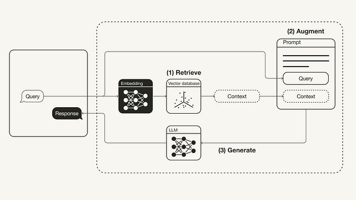
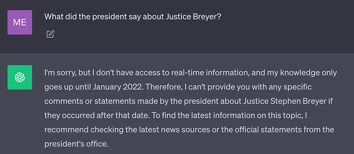

Since the realization that you can supercharge large language models (LLMs) with your proprietary data, there has been some discussion on how to most effectively bridge the gap between the LLM’s general knowledge and your proprietary data. There has been a lot of debate around [whether fine-tuning or Retrieval-Augmented Generation (RAG) is more suited for this](https://towardsdatascience.com/rag-vs-finetuning-which-is-the-best-tool-to-boost-your-llm-application-94654b1eaba7) (spoiler alert: it’s both).

This article first focuses on the concept of RAG and first covers its theory. Then, it goes on to showcase how you can implement a simple RAG pipeline using [LangChain](https://www.langchain.com/) for orchestration, [OpenAI](https://openai.com/) language models, and a [Weaviate](https://weaviate.io/) vector database.

## What is Retrieval-Augmented Generation

Retrieval-Augmented Generation (RAG) is the concept to provide LLMs with additional information from an external knowledge source. This allows them to generate more accurate and contextual answers while reducing hallucinations.

### Problem

State-of-the-art LLMs are trained on large amounts of data to achieve a broad spectrum of general knowledge stored in the neural network's weights (parametric memory). However, prompting an LLM to generate a completion that requires knowledge that was not included in its training data, such as newer, proprietary, or domain-specific information, can lead to factual inaccuracies (hallucinations), as illustrated in the following screenshot:



Thus, it is important to bridge the gap between the LLM’s general knowledge and any additional context to help the LLM generate more accurate and contextual completions while reducing hallucinations.

### Solution

Traditionally, neural networks are adapted to domain-specific or proprietary information by fine-tuning the model. Although this technique is effective, it is also compute-intensive, expensive, and requires technical expertise, making it less agile to adapt to evolving information.

In 2020, Lewis et al. proposed a more flexible technique called Retrieval-Augmented Generation (RAG) in the paper [Retrieval-Augmented Generation for Knowledge-Intensive NLP Tasks](https://arxiv.org/abs/2005.11401) [1]. In this paper, the researchers combined a generative model with a retriever module to provide additional information from an external knowledge source that can be updated more easily.

---

**In simple terms**, RAG is to LLMs what an open-book exam is to humans. In an open-book exam, students are allowed to bring reference materials, such as textbooks or notes, which they can use to look up relevant information to answer a question. The idea behind an open-book exam is that the test focuses on the students’ reasoning skills rather than their ability to memorize specific information.

Similarly, the factual knowledge is separated from the LLM’s reasoning capability and stored in an external knowledge source, which can be easily accessed and updated:

- **Parametric knowledge:** Learned during training that is implicitly stored in the neural network's weights.
- **Non-parametric knowledge:** Stored in an external knowledge source, such as a vector database.

(By the way, I didn’t come up with this genius comparison. As far as I know, this comparison was [first mentioned by JJ during the Kaggle — LLM Science Exam competition](https://www.kaggle.com/code/jjinho/open-book-llm-science-exam).)

The vanilla RAG workflow is illustrated below:


1. **Retrieve:** The user query is used to retrieve relevant context from an external knowledge source. For this, the user query is embedded with an embedding model into the same vector space as the additional context in the vector database. This allows to perform a similarity search, and the top k closest data objects from the vector database are returned.
2. **Augment:** The user query and the retrieved additional context are stuffed into a prompt template.
3. **Generate:** Finally, the retrieval-augmented prompt is fed to the LLM.

## Retrieval-Augmented Generation Implementation using LangChain

This section implements a RAG pipeline in Python using an OpenAI LLM in combination with a [Weaviate](https://weaviate.io/) vector database and an OpenAI embedding model. [LangChain](https://openai.com/) is used for orchestration.

### Prerequisites

Make sure you have installed the required Python packages:

* `langchain` for orchestration
* `openai` for the embedding model and LLM
* `weaviate-client` for the vector database

```
#!pip install langchain openai weaviate-client
```

Additionally, define your relevant environment variables in a .env file in your root directory. To obtain an OpenAI API Key, you need an OpenAI account and then “Create new secret key” under API keys.

```python
OPENAI_API_KEY="<YOUR_OPENAI_API_KEY>"
```

Then, run the following command to load the relevant environment variables.

```python
import dotenv
dotenv.load_dotenv()
```

### Preparation

As a preparation step, you need to prepare a vector database as an external knowledge source that holds all additional information. This vector database is populated by following these steps:

1. Collect and load your data
2. Chunk your documents
3. Embed and store chunks

The first step is to **collect and load your data** — For this example, you will use [President Biden’s State of the Union Address from 2022](https://www.whitehouse.gov/state-of-the-union-2022/) as additional context. The raw text document is available in [LangChain’s GitHub repository](https://raw.githubusercontent.com/langchain-ai/langchain/master/docs/docs/modules/state_of_the_union.txt). To load the data, You can use one of LangChain’s many built-in [`DocumentLoader`s](https://api.python.langchain.com/en/latest/api_reference.html#module-langchain.document_loaders). A `Document` is a dictionary with text and metadata. To load text, you will use LangChain’s `TextLoader`.

```python
import requests
from langchain.document_loaders import TextLoader

url = "https://raw.githubusercontent.com/langchain-ai/langchain/master/docs/docs/modules/state_of_the_union.txt"
res = requests.get(url)
with open("state_of_the_union.txt", "w") as f:
    f.write(res.text)

loader = TextLoader('./state_of_the_union.txt')
documents = loader.load()
```

Next, **chunk your documents** — Because the `Document`, in its original state, is too long to fit into the LLM’s context window, you need to chunk it into smaller pieces. LangChain comes with many built-in [text splitters](https://python.langchain.com/docs/modules/data_connection/document_transformers/) for this purpose. For this simple example, you can use the `CharacterTextSplitter` with a `chunk_size` of about 500 and a `chunk_overlap` of 50 to preserve text continuity between the chunks.

```python
from langchain.text_splitter import CharacterTextSplitter
text_splitter = CharacterTextSplitter(chunk_size=500, chunk_overlap=50)
chunks = text_splitter.split_documents(documents)
```

Lastly, **embed and store the chunks** — To enable semantic search across the text chunks, you need to generate the vector embeddings for each chunk and then store them together with their embeddings. To generate the vector embeddings, you can use the OpenAI embedding model, and to store them, you can use the Weaviate vector database. By calling `.from_documents()` the vector database is automatically populated with the chunks.

```python
from langchain.embeddings import OpenAIEmbeddings
from langchain.vectorstores import Weaviate
import weaviate
from weaviate.embedded import EmbeddedOptions

client = weaviate.Client(
  embedded_options = EmbeddedOptions()
)

vectorstore = Weaviate.from_documents(
    client = client,    
    documents = chunks,
    embedding = OpenAIEmbeddings(),
    by_text = False
)
```

### Step 1: Retrieve

Once the vector database is populated, you can define it as the retriever component, which fetches the additional context based on the semantic similarity between the user query and the embedded chunks.

```python
retriever = vectorstore.as_retriever()
```

### Step 2: Augment

Next, to augment the prompt with the additional context, you need to prepare a prompt template. The prompt can be easily customized from a prompt template, as shown below.

```python
from langchain.prompts import ChatPromptTemplate

template = """You are an assistant for question-answering tasks. 
Use the following pieces of retrieved context to answer the question. 
If you don't know the answer, just say that you don't know. 
Use three sentences maximum and keep the answer concise.
Question: {question} 
Context: {context} 
Answer:
"""
prompt = ChatPromptTemplate.from_template(template)

print(prompt)
```

### Step 3: Generate

Finally, you can build a chain for the RAG pipeline, chaining together the retriever, the prompt template and the LLM. Once the RAG chain is defined, you can invoke it.

```python
from langchain.chat_models import ChatOpenAI
from langchain.schema.runnable import RunnablePassthrough
from langchain.schema.output_parser import StrOutputParser

llm = ChatOpenAI(model_name="gpt-3.5-turbo", temperature=0)

rag_chain = (
    {"context": retriever,  "question": RunnablePassthrough()} 
    | prompt 
    | llm
    | StrOutputParser() 
)

query = "What did the president say about Justice Breyer"
rag_chain.invoke(query)
```

```python
"The president thanked Justice Breyer for his service and acknowledged his dedication to serving the country. The president also mentioned that he nominated Judge Ketanji Brown Jackson as a successor to continue Justice Breyer's legacy of excellence."
```

You can see the resulting RAG pipeline for this specific example illustrated below:


## Summary

This article covered the concept of RAG, which was presented in the paper [Retrieval-Augmented Generation for Knowledge-Intensive NLP Tasks](https://arxiv.org/abs/2005.11401) [1] from 2020. After covering some theory behind the concept, including motivation and problem solution, this article converted its implementation in Python. This article implemented a RAG pipeline using an OpenAI LLM in combination with a Weaviate vector database and an OpenAI embedding model. LangChain was used for orchestration.

## References

[1] Lewis, P., et al. (2020). Retrieval-augmented generation for knowledge-intensive NLP tasks. Advances in Neural Information Processing Systems, 33, 9459–9474.

---
*I am a Developer Advocate at [Weaviate](https://weaviate.io/) at the time of this writing. In addition to this article, I have also added the same example to the [Weaviate notebook in the LangChain documentation](https://python.langchain.com/docs/integrations/vectorstores/weaviate). Alternatively, you can start by following the [`rag-weaviate` template in LangChain](https://github.com/langchain-ai/langchain/tree/master/templates/rag-weaviate).*

*This blog was originally published on Towards Data Science on Nov 14, 2023 and moved to this site on Jul 30, 2025.*